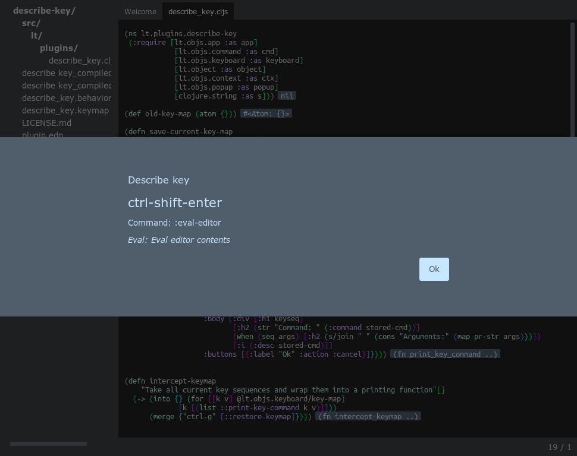

# Describe Key

Give LT the same `ctrl-h k` capabilities as Emacs.

## Usage

`ctrl-h k` will cause the next sucessful key sequence to trigger a message showing what command would have been called.

Can be cancelled by doing `ctrl-g`.

## Changelog

* 0.0.3-5 Fixes precompiled files.
* 0.0.2 Fixes bug when the key called a command with an argument.
* 0.0.1 Initial release.

## License

Copyright © 2014 Frozenlock

GNU General Public License version 3.0 (GPLv3)
